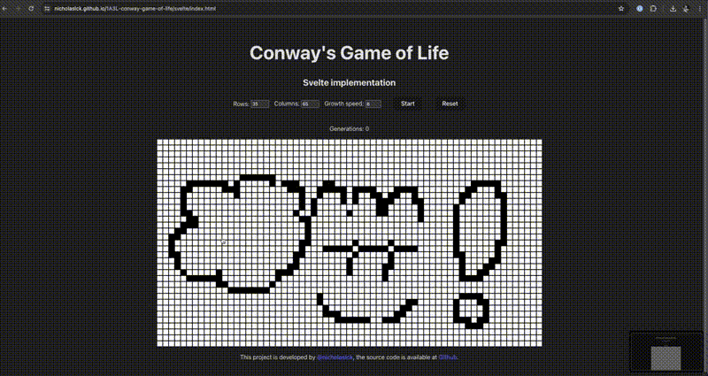

# 1A3L-conway-game-of-life

This is a project under the 1-App-3-Languages (1A3L) series.
It implements the [Conway's Game of Life](https://en.wikipedia.org/wiki/Conway%27s_Game_of_Life) under 3 language: Svelte, React and XXXX (TBD)

Demo site: https://nicholaslck.github.io/1A3L-conway-game-of-life/



## Getting Started

### Install

```bash
npm install
```

### React app

```bash
npm run install:react
npx nx dev react
```

### Svelte app

```bash
npm run install:svelte
npx nx dev svelte
```

## Features

| Feature                     | Svelte | React | Flutter |
| --------------------------- | ------ | ----- | ---- |
| Rows and Cols configuration | ✅      | ✅     | ✅     |
| Display game board          | ✅      | ✅     | ✅     |
| Reset game board            | ✅      | ✅     | ✅     |
| Start/Stop the game         | ✅      | ✅     | ✅     |
| Growth speed configuration  | ✅      | ✅     | ✅     |
| Click to change cell state  | ✅      | ✅     | ✅     |
| Drag to change cells states | ✅      | ✅     |      |
| Randomize cells             |        |       |      |

---

<a alt="Nx logo" href="https://nx.dev" target="_blank" rel="noreferrer"></a>

✨ **This workspace has been initiate by [Nx, Smart Monorepos · Fast CI.](https://nx.dev)** ✨
